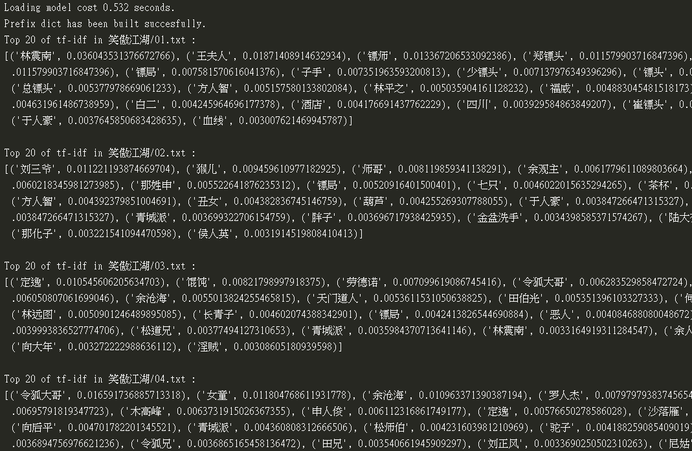
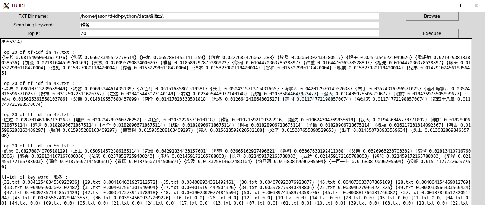
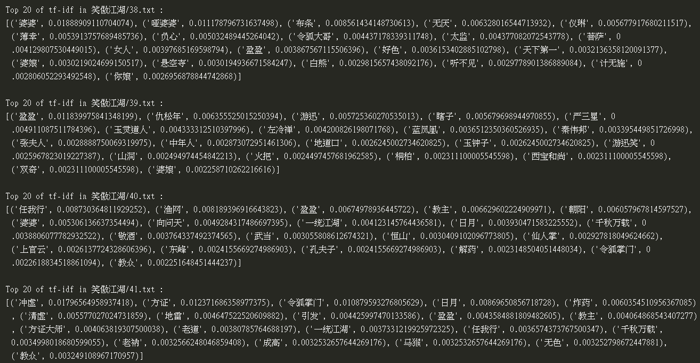
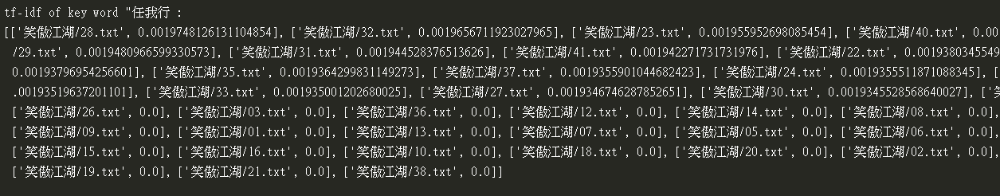

# tf–idf-python

tf-idf, short for term frequency–inverse document frequency, is a numerical statistic that is intended to reflect how important a word is to a document in a collection or corpus.

*
Enter Chinese novel "笑傲江湖" files, each of which is a chapter in the novel, and output the Top-K words and their weights in each chapter.
*

The purpose of this project is to implement tf-idf, input **given a set of files with a specific relationship**, and output **the tf-idf weight value of each file**. Specifically, the "word" with the highest k is displayed and its weight value, as shown in the figure above. Alternatively, you can enter a word and output a weight value for that word in all files.

English can be segmented by blanks, but Chinese cannot. So we used [Jieba Chinese text segmentation](https://github.com/fxsjy/jieba) to collect the corpus of word. The word weighting value is then obtained using the tf-idf algorithm.

In fact, [jieba]((https://github.com/fxsjy/jieba)) also has built-in "keyword extraction based on td-idf algorithm", but according to its source code, jieba actually only reads one file to calculate TF. The IDF part reads their own custom corpus, so the result is not accurate (not based on the set of related files to calculate the inverse frequency). Specifically, you can try simple tf-idf jieba version [here](./src/tf-idf-jieba.py).

## Requirements

* Python 3
* jieba

## Getting Started

### Console

    git clone https://github.com/Jasonnor/tf-idf-python.git
    cd tf-idf-python/src/
    python -u tf_idf.py

### Sample GUI

    python -u main_gui.py

## Preview

*
Sample GUI Result
*

*
A list of the weights of the chapters in the "笑傲江湖" dataset, you can see the important keyword rankings for each chapter.
*

*
The weight of the word "任我行" in each chapter. You can see that "任我行" played the most in Chapter 28, and the part with the value of 0 can tell that he did not appear.
*

## Contributing

Please feel free to [open issues](https://github.com/Jasonnor/tf-idf-python/issues) or submit [pull requests](https://github.com/Jasonnor/tf-idf-python/pulls).

## Reference

* Tf-idf. (n.d.). in Wikipedia - [https://zh.wikipedia.org/wiki/Tf-idf](https://zh.wikipedia.org/wiki/Tf-idf)
* jieba - [https://github.com/fxsjy/jieba](https://github.com/fxsjy/jieba)

## License

tf–idf-python is released under the MIT License. See the [LICENSE](/LICENSE) file for details.
